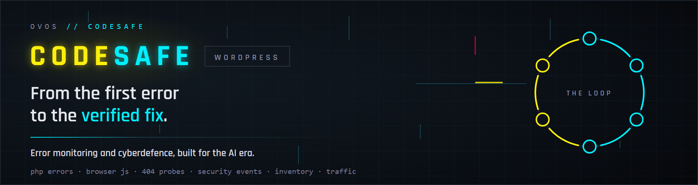
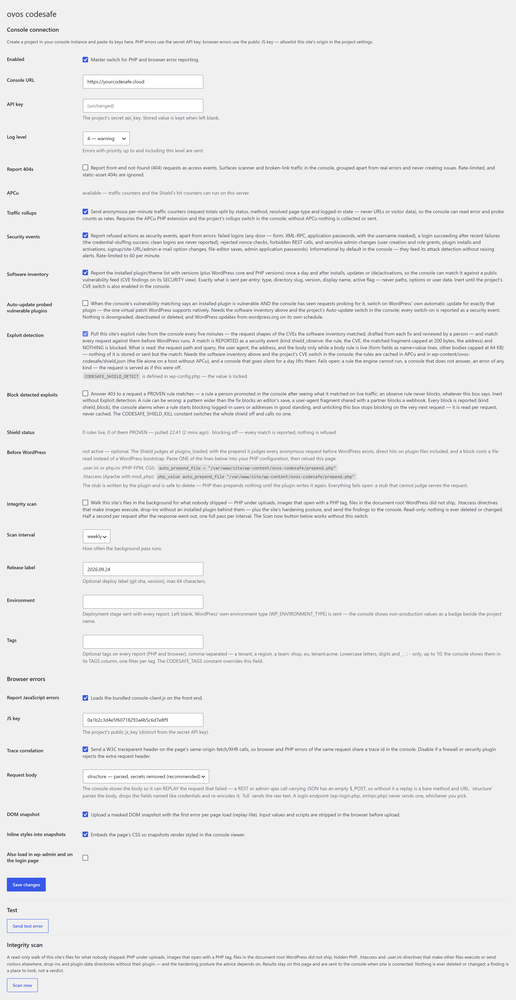
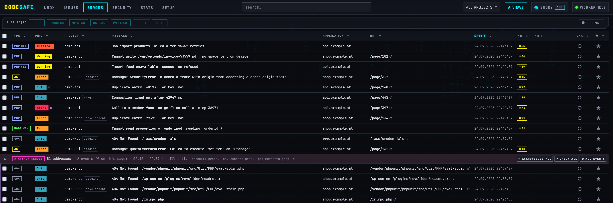

<p align="center">
	
</p>

# ovos codesafe — error monitoring and cyberdefence for WordPress

This plugin sends a WordPress site's PHP errors, JavaScript errors, failed logins and scanner probes to [ovos codesafe](https://ovos.github.io/codesafe/), which ranks what broke, proposes the fix, and reads the attacks on your site as a map of your weak spots. You get **your own codesafe instance** — run for you by ovos, or set up on your own infrastructure for larger organisations. **The plugin is the client, and it is free** — GPL-2.0, no telemetry of its own. [Talk to us](#talk-to-us) about getting an instance, or [try the live demo](https://console-demo.ovos.at/) first.

**Roughly half of what a public WordPress site reports is not a bug** — it is scanners looking for a way in. codesafe counts those apart from real errors, folds them into attack waves, matches your installed plugins against the vulnerability feeds so "vulnerable **and** being probed" is something you see rather than guess, and, for a CVE with no patch out yet, lets this plugin **shield** the site against the exploit's request shape until the update lands.

## Contents

- [Requirements](#requirements) · [Quick start](#quick-start) · [Recommended settings](#recommended-settings) · [APCu](#apcu)
- [Settings reference](#settings-reference) · [What leaves the site](#what-leaves-the-site-and-what-never-does) · [Updates](#updates) · [Coming from ovos-console](#coming-from-ovos-console) · [Troubleshooting](#troubleshooting)
- [What codesafe does with it](#what-codesafe-does-with-it) · [Advanced](#advanced) · [For developers](#for-developers) · [Talk to us](#talk-to-us)
- The long version of every feature: [docs/FEATURES.md](docs/FEATURES.md)

## Requirements

- **WordPress 6.0+** and **PHP 8.3+** — the `Requires PHP` header keeps older hosts from activating it.
- **An ovos codesafe instance** reachable from this site (HTTPS). One instance serves all your sites and services.
- **APCu — optional, but worth having.** Traffic rollups need it; nothing else does. See [APCu](#apcu).

## Quick start

1. **Install.** Download [`ovos-codesafe.zip`](https://github.com/ovos/codesafe-client-wordpress/releases/latest/download/ovos-codesafe.zip) and upload it under **Plugins → Add New Plugin → Upload Plugin**, or:

   ```sh
   wp plugin install https://github.com/ovos/codesafe-client-wordpress/releases/latest/download/ovos-codesafe.zip --activate
   ```

   The plugin is not on wordpress.org; it updates itself from this repository afterwards ([Updates](#updates)).

2. **Create the project in codesafe.** On the PROJECTS tab, add a project for this site and note its secret **api_key** and public **js_key**. For browser errors, switch JS errors on for the project and allowlist this site's exact origin (`https://www.example.com`).

3. **Connect.** In wp-admin go to **Settings → ovos codesafe**: enter the instance URL in *Console URL*, the two keys, tick **Enabled**, save.

4. **Test.** Click **Send test error**. The page reports codesafe's answer, and the error is in the grid within a second.

5. **Turn on the switches below** — every one is off until you say so.

Prefer code? Each setting has a `wp-config.php` constant that wins over the page and locks the field:

```sh
wp config set CODESAFE_ENABLED true --raw
wp config set CODESAFE_URL https://codesafe.example
wp config set CODESAFE_API_KEY 'the project api_key'
wp config set CODESAFE_JS_KEY 'the project js_key'
```

## Recommended settings

<p align="center">
	
</p>

**Turn on everywhere.** None of these blocks anything or changes the site; each says exactly what it sends.

| Setting | Set it to | Why |
|---|---|---|
| Enabled | on | the master switch |
| Log level | `4 — warning` (the default) | warnings and worse; `3 — error` for a noisy legacy site, `5 — notice` when you want more |
| Report 404s | on | scanner and broken-link traffic, counted apart from errors and never turned into issues — this is the probe signal |
| Security events | on | failed logins, the login that succeeded after failures, rejected nonces, forbidden REST calls, sensitive admin changes — usernames masked, a per-minute budget per kind (a flood is summarised, admin changes never held back) |
| Software inventory | on, **and** the project's CVE switch in codesafe | your plugin and theme versions against the vulnerability feeds; "vulnerable and being probed" needs this |
| Exploit detection | on | pulls the exploit rules for the CVEs you run and **reports** matches; blocks nothing |
| Integrity scan | on, weekly | a read-only walk for files nobody shipped and the site's hardening posture; press **Scan now** once right after installing |
| Report JavaScript errors | on, with the JS key | window errors, unhandled rejections, failed fetch/XHR calls from the browser |
| Trace correlation | on (the default) | a failed browser request and the PHP error behind it share one trace id; off only if a firewall rejects the extra header |
| Request body | `structure` (the default) | the failing request's body, parsed and cleaned of credentials, so codesafe can replay it |

**Turn on when it applies.**

| Setting | When | Why |
|---|---|---|
| Traffic rollups | when the [APCu](#apcu) line says *available* — **and** tick *Traffic rollups* on the project in codesafe | error and probe counts become rates against real traffic, and the PERFORMANCE panel gets its response-time trends |
| Auto-update probed vulnerable plugins | on sites that let WordPress update plugins anyway | a plugin that is vulnerable **and** probed gets WordPress' own auto-update switched on — the one virtual patch WordPress supports natively; sites with a release pipeline update through it instead |
| Block detected exploits | after a week of detection, once codesafe shows what the rules matched — **and** the project's blocking switch in codesafe | 403 on a request matching a rule a person marked PROVEN — and 429 with `Retry-After` past a proven rate rule's limit (search, login, a heavy route; needs APCu); observe rules never block, unticking acts on the next request, and codesafe alarms if a rule starts refusing real visitors ([the Shield](docs/FEATURES.md#the-shield)) |
| Release label | when you deploy with a version or a commit | every report carries it, and codesafe compares a release against the one before |
| Environment | on staging and test sites | `staging` shows as a badge beside the project name; blank sends WordPress' own `WP_ENVIRONMENT_TYPE` |
| Tags | when one instance serves many tenants or regions | one filter per tag in codesafe |
| DOM snapshot | when you want to *see* the page a browser error happened on | a masked snapshot (inputs and scripts stripped) with the first error per page load |

**Leave off unless you know why:** *Inline styles into snapshots* (bigger uploads), *Also load in wp-admin* (noisier, admin-side JavaScript errors), and the Shield's `CODESAFE_SHIELD_KILL` constant, which is for a host that must never call home.

**Some switches have a second half in codesafe**, on the project: the rollups switch, the CVE switch, the Auto-update switch, the JS origins allowlist and, for blocking, the project's own blocking switch. Either half off keeps the feature inert, so the order you enable them in does not matter.

## APCu

APCu is PHP's shared memory between requests. On this page it matters for one switch:

- **Traffic rollups need it.** The per-minute counters accumulate in APCu and one request per minute ships them. Without APCu the switch collects nothing and sends nothing — deliberately silent, because a host without shared memory could only produce wrong numbers. The Shield's per-rule hit counters ride the same memory, so they are missing too.
- **Everything else works without it.** Errors, security events, the inventory, the integrity scan and the Shield's matching itself — the Shield keeps its rules in a file under `wp-content/ovos-codesafe/` (or `CODESAFE_STORE_DIR`) when there is no APCu. Only the Shield's rate rules need it too: without APCu they are skipped.

**How to tell:** the settings page says so on the **APCu** line right above *Traffic rollups* — *available* or *NOT available on this server's PHP*. Ask your host to enable the `apcu` extension for the **web server's** PHP (mod_php or PHP-FPM); on your own server that is `apt install php-apcu` or the equivalent, then a restart of PHP. The command line's `php -m` does not count: CLI PHP usually has APCu off even when the web server has it on.

## Settings reference

Every value lives under **Settings → ovos codesafe**, or as a constant in `wp-config.php` — a defined constant wins and locks the field.

| Setting | Constant | Default | |
|---|---|---|---|
| Enabled | `CODESAFE_ENABLED` | `false` | master switch for PHP and browser reporting |
| Console URL | `CODESAFE_URL` | — | the codesafe instance's base URL, e.g. `https://codesafe.example` |
| API key | `CODESAFE_API_KEY` | — | the project's secret api_key (PHP errors) |
| Log level | `CODESAFE_LOG_LEVEL` | `4` | send errors with syslog priority ≤ this (0 emergency … 7 debug) |
| Report 404s | `CODESAFE_REPORT_404` | `false` | front-end not-found requests as access events — rate-limited, static assets ignored, never issues |
| Traffic rollups | `CODESAFE_ROLLUPS` | `false` | anonymous per-minute request counters and duration histograms; needs APCu and the project's rollups switch |
| Security events | `CODESAFE_SECURITY_EVENTS` | `false` | refused actions and sensitive admin changes as `security` events; a per-minute budget per kind, the excess summarised |
| Software inventory | `CODESAFE_INVENTORY` | `false` | installed plugin/theme/core versions, daily and on change; needs the project's CVE switch |
| Auto-update probed vulnerable plugins | `CODESAFE_AUTO_UPDATE_VULNERABLE` | `false` | WordPress' own auto-update, switched on for a plugin that is vulnerable and probed; needs the inventory and the project's Auto-update switch |
| Exploit detection | `CODESAFE_SHIELD_DETECT` | `false` | pull this site's exploit rules every five minutes and match every request before WordPress runs; matches are reported, nothing is blocked; fails open |
| Block detected exploits | `CODESAFE_SHIELD_ENFORCE` | `false` | 403 on a request a PROVEN rule matches; inert without detection; read per request |
| — | `CODESAFE_SHIELD_KILL` | `false` | constant only: the whole Shield off, no network |
| Integrity scan | `CODESAFE_SCAN` | `false` | the background read-only walk for files nobody shipped; **Scan now** works without it |
| Scan interval | `CODESAFE_SCAN_INTERVAL` | `7` | days between background passes (`1` or `7`) |
| Release label | `CODESAFE_RELEASE` | — | deploy label on every report, announced to codesafe once when it changes |
| Environment | `CODESAFE_ENVIRONMENT` | — | deployment stage; blank sends `WP_ENVIRONMENT_TYPE` |
| Tags | `CODESAFE_TAGS` | — | comma list on every report (`shop, eu, tenant:acme`); lowercase, up to ten |
| Report JS errors | `CODESAFE_JS_ENABLED` | `true` | loads the bundled browser client on the front end |
| JS key | `CODESAFE_JS_KEY` | — | the project's public js_key (browser errors) |
| Trace correlation | `CODESAFE_JS_TRACE` | `true` | W3C traceparent header on the page's same-origin fetch/XHR calls |
| Request body | `CODESAFE_REQUEST_BODY` | `structure` | `off` — none; `structure` — parsed, credentials dropped, 8 KB; `full` — the raw body, 16 KB |
| DOM snapshot | `CODESAFE_SNAPSHOT` | `false` | masked DOM snapshot with the first error per page load |
| Inline snapshot styles | `CODESAFE_SNAPSHOT_STYLES` | `false` | embed the page's CSS so snapshots render styled |
| Load in wp-admin | `CODESAFE_JS_ADMIN` | `false` | also report browser errors from wp-admin and the login page |
| Trusted proxy header | `CODESAFE_TRUSTED_PROXY_HEADER` | — | behind a proxy/CDN only: the header naming the visitor (`CF-Connecting-IP`, `X-Forwarded-For`); read only from the ranges below |
| Trusted proxy ranges | `CODESAFE_TRUSTED_PROXIES` | — | the proxies' CIDRs or addresses, comma-separated; `cloudflare` = Cloudflare's published ranges (bundled). Empty: `REMOTE_ADDR` is the visitor |
| — | `CODESAFE_STORE_DIR` | — | constant only: an absolute directory **outside the document root** for the Shield's and the watch's store (recommended on nginx/IIS); the prepend stub stays in `wp-content/ovos-codesafe/` |

Example `wp-config.php` block:

```php
define('CODESAFE_ENABLED', true);
define('CODESAFE_URL', 'https://codesafe.example');
define('CODESAFE_API_KEY', '...');
define('CODESAFE_JS_KEY', '...');
define('CODESAFE_RELEASE', '2026.09.24');
define('CODESAFE_ENVIRONMENT', 'production');
```

## What leaves the site, and what never does

Every report is reduced in the plugin before it is sent; codesafe redacts again on its side as a backstop.

- **Errors** travel with their request context: the URL, method, headers and variables, the logged-in user id, WordPress version, active theme, and which plugin or theme the failing file belongs to. **Credentials are dropped by field name** wherever they stand — passwords in every spelling, tokens, keys, cookies, authorization headers, CSRF nonces, card numbers and security codes, account numbers and IBANs, and in the request's query and post the reset link's `key`, `code`, `otp`, `sig` and their kin. The request body is parsed and cleaned the same way (`structure`), or not sent at all (`off`). **E-mail addresses and usernames travel as written** — in the variables, the body, the URL and referrer, the extra data and a WP-CLI command's arguments: codesafe masks them on arrival and keeps the original encrypted for an audited reveal and a replay. Masked here, they could never be revealed.
- **Security events** carry the refused action's kind, the masked username or the option's *name*, never a value. The username is the one identity masked here: inside a sentence (`login failed for m***i*`) codesafe could not recognise it, and the account travels beside it as its user id. A login typed as an e-mail address travels as written, for codesafe to mask and keep.
- **Traffic rollups** are counts under names WordPress defines — never a URL, an address, a user agent or a cookie.
- **The inventory** is the list of what is installed with versions — never paths, options or user data.
- **The integrity scan** sends paths, sizes and dates — never a file's content — and changes nothing on the site.
- **The Shield** sends the matched fragment of a flagged request, capped at 200 bytes, and reads the request body only while a body rule is live.
- **Browser reports** strip input values and scripts from a DOM snapshot before upload.

The full account, per feature, is in [docs/FEATURES.md](docs/FEATURES.md#what-never-leaves-the-site).

## Updates

The plugin updates itself from this repository through WordPress' own update flow: new versions appear under **Dashboard → Updates** and install like any directory plugin, one click or unattended (**Enable auto-updates** on the Plugins screen, or `wp plugin auto-updates enable ovos-codesafe`). **Every release is signed**, and the plugin verifies the signature before WordPress installs a byte; a package that does not verify is refused, a release without a signature is not offered. Details, and how to pin a version, in [docs/FEATURES.md](docs/FEATURES.md#automatic-signed-updates).

## Coming from ovos-console

The plugin was called `ovos-console` before 1.0.0. WordPress treats the new directory as a different plugin, so a site that runs `ovos-console` installs `ovos-codesafe` beside it and activates it. The rest happens by itself:

- **Settings** are copied from the `ovos_console*` options on first load. The old rows stay until you delete the old plugin.
- **The old plugin is deactivated** on the next admin page, so nothing is reported twice, and a notice says it can be deleted under Plugins.
- **`OVOS_CONSOLE_*` constants** in wp-config.php keep working; `CODESAFE_*` wins where both are defined. The settings page names each old one it finds.
- **`ovos_console()`** and the **`ovos_console_sslverify`** / **`ovos_console_sslverify_wporg`** filters keep working beside `ovos_codesafe()` and the `ovos_codesafe_*` filters.
- **The Shield before WordPress:** if PHP's `auto_prepend_file` still names `wp-content/ovos-console/prepend.php`, that stub is rewritten to run this plugin, so the layer stays on. Point the directive at `wp-content/ovos-codesafe/prepend.php` when convenient, and do not delete the old file before you have: PHP fails every request whose prepend file is gone.

## Troubleshooting

- **"Console unreachable — check the URL."** The site could not reach the instance: a typo in the URL, a firewall between the host and codesafe, or a self-signed certificate — see [Advanced](#advanced) for the TLS switch.
- **"Console rejected the key."** The API key is not the project's api_key, or belongs to another project. Copy it again from the project in codesafe.
- **Browser errors do not arrive.** *Report JavaScript errors* on, the **JS key** set, JS errors switched on for the project, and this site's exact origin (`https://www.example.com`, no path) in the project's JS origins.
- **Traffic rollups show nothing.** The APCu line above the switch says *NOT available*, or the project's rollups switch in codesafe is off. Cached pages served before WordPress boots are never counted, by design.
- **No CVE findings.** The inventory needs the project's CVE switch in codesafe; the first report goes out at the next request after saving, and the matching runs nightly.
- **Shield status says "no ruleset yet".** The first request after saving pulls it; "off — …" names which switch is missing. A rule exists only while codesafe has an open CVE finding for this site, so an empty ruleset on a fully updated site is the normal state.
- **A blocking rule refuses a real visitor.** Untick *Block detected exploits* — it acts on the very next request — and demote the rule in codesafe; the INBOX will already carry its alarm.

## What codesafe does with it

<p align="center">
	<a href="https://console-demo.ovos.at/"></a>
</p>

**[Try the live demo →](https://console-demo.ovos.at/)** — a public instance filled with synthetic errors, no login. One codesafe for everything you run:

- **Issues, not noise** — the same error a thousand times is one row with a count and an open → resolved → regressed lifecycle; a failed browser request and the PHP error behind it share one trace id.
- **The INBOX** — one list of what needs a person now, across issues, attack campaigns, probed CVE findings, files nobody shipped, late monitors, releases and the Shield's alarms, most urgent first, each with its one ready action.
- **Security** — probes folded into waves and cross-site campaigns, an address reputation, a blocklist export for your edge, CVE findings with a PROBED count, and the Shield's rules — drafted from the CVE's fix, published to the sites that carry the finding, promoted to blocking only by a person.
- **Releases and performance** — a release compared against the one before it; response-time trends from the rollups.
- **Alerting** — throttled mail and chat per project; policies that notify, ticket or assign by themselves.
- **Ask your AI** — point Claude or any MCP client at codesafe, or hit `◇ AI EXPLAIN` on a row for a root-cause read.

Your own instance, not a shared tenancy — run for you by ovos in Vienna, or on your own infrastructure when the data has to stay there. More on the [product page](https://ovos.github.io/codesafe/).

## Advanced

**A self-signed certificate on the instance** (intranet setups) — TLS verification of the ingest call is on by default; disable it from an mu-plugin or your theme:

```php
add_filter('ovos_codesafe_sslverify', '__return_false');
```

The integrity scan's checksum lists come from wordpress.org over TLS; behind a proxy that re-signs traffic, that verification has its own switch: `add_filter('ovos_codesafe_sslverify_wporg', '__return_false');`

**Manual captures** from theme or plugin code — safe to call unconditionally, no-ops while the plugin is disabled:

```php
ovos_codesafe()->captureException($e, ['orderId' => 7]);
ovos_codesafe()->captureMessage('checkout step skipped', 4); // priority 4 = warning
```

**The Shield before WordPress** (optional, `auto_prepend_file`). The `plugins_loaded` hook never sees a direct request to a plugin file, and a block there has already paid for the WordPress bootstrap. The settings page prints one line for your PHP configuration that points PHP's prepend at a stub the plugin writes into `wp-content/ovos-codesafe/`:

```ini
; .user.ini or php.ini (PHP-FPM, CGI)
auto_prepend_file = "/var/www/site/wp-content/ovos-codesafe/prepend.php"
```

```apache
# .htaccess (Apache with mod_php)
php_value auto_prepend_file "/var/www/site/wp-content/ovos-codesafe/prepend.php"
```

With it, every anonymous request is judged before WordPress exists; a request carrying a login cookie to a file WordPress runs through (`index.php`, `wp-login.php`, wp-admin's own pages …) is judged at `plugins_loaded` as before, and anywhere else — a direct hit on a plugin's file — by this layer, cookie or not. The stub is outside the plugin directory and includes the plugin only if it is still there, so removing the plugin never leaves PHP with a missing prepend file; the layer fails open on everything; the settings page says *ACTIVE* once PHP reports the directive. The plugin never edits your server configuration. Every file in the store begins with a PHP `exit` and the ruleset's file name is random, so a server that ignores `.htaccess` (nginx, IIS) serves nothing from it — the settings page warns there, and `CODESAFE_STORE_DIR` moves the data out of the document root. **Deactivating** the plugin switches the layer off through its consent file; **uninstalling** removes the store, leaving the stub in place (doing nothing) while PHP still names it — remove the `auto_prepend_file` line, then the directory. On a **multisite** network the Shield, the watch and the trusted proxy are the main site's, set by a super admin. Details in [docs/FEATURES.md](docs/FEATURES.md#the-shield).

**The executed-file watch** rides the same layer (on by default while it is active; the *Executed-file watch* box or `CODESAFE_ENTRY_WATCH` switches it off): every PHP file the site runs that WordPress did not ship as an entry point is recorded the moment it runs — size, md5, the request's address — and judged on the next request against what wordpress.org shipped. A file nobody shipped becomes an integrity finding in the console, with one security event (`file_executed`) for the address that ran it. Details in [docs/FEATURES.md](docs/FEATURES.md#the-executed-file-watch).

**Pinning or rolling back** to one version, for a fleet:

```sh
wp plugin install https://github.com/ovos/codesafe-client-wordpress/releases/download/v1.0.0/ovos-codesafe.zip --force
```

**From git** — clone into `wp-content/plugins/ovos-codesafe` (the directory name matters), activate, update with `git pull`, and leave auto-updates off for that copy: an update from wp-admin replaces the whole directory with the release zip.

## For developers

- The repository root **is** the plugin directory — junction or symlink it into `wp-content/plugins/ovos-codesafe`.
- `assets/console-client.js` is a byte-identical copy of codesafe's browser client (intentionally ES5), and `src/Shield/Kernel.php` of its request-side kernel; both are synced from the console repository, never edited here. `Tests\Shield` holds the kernel copy to php-library's (and to the console's `client-php/Shield.php` when a checkout is beside this one) and smokes a judge without WordPress.
- Tests run on php-library's harness, the way the console's do, and on every push (`.github/workflows/tests.yml`, PHP 8.3–8.5): `cd ci && composer install && cp .env.tests .env && php cli.php tests run`. `ci/` is a test-only application and `tests/` holds the classes — the Updater's signed-update path, the Shield kernel and the prepend layer, and `Tests\Sanitizer`, which drives a WooCommerce checkout through the plugin's real request path so no password, cookie or nonce leaves the site raw. Neither directory ships in the release zip.
- Two classes skip themselves unless pointed somewhere: `Tests\SanitizerStored` runs the same checkout through the console's own scrubbing (`OVOS_CONSOLE_PATH`, or `../console` beside this repository), and `Tests\WordPressLive` drives the signed update on a real WordPress with this plugin active (`OVOS_WP_PATH`).
- The product is codesafe; the identifiers stay: the `ovos-codesafe` slug and directory, the text domain, the `CODESAFE_*` constants, the `ovos_codesafe_*` filters and the `ovos-codesafe.zip` asset every install URL and updater knows.
- Releasing: [`docs/RELEASE.md`](docs/RELEASE.md) — the four version spots, the changelog, one `v*` tag; the workflow verifies, builds, signs and publishes.

## Talk to us

codesafe is built and run by [ovos](https://ovos.at/) in Vienna. We use it on our own client sites every day, which is why it is shaped the way it is.

- **Questions about the plugin, or a bug in it** — open an [issue](https://github.com/ovos/codesafe-client-wordpress/issues).
- **Want codesafe for your sites?** Write to **[office@ovos.at](mailto:office@ovos.at)**. You get your own instance: we run it for you, or for larger organisations we set one up on your own infrastructure. Happy to just answer whether it fits what you have.
- **Try it first** — the [live demo](https://console-demo.ovos.at/) needs no login.

## License

This plugin is [GPL-2.0-or-later](LICENSE) and always will be — it is a WordPress plugin and a client, and you can read, fork and audit every line of what runs on your site.

The ovos codesafe it talks to is a commercial product — your own instance, run for you by ovos or set up on your infrastructure. It is not covered by this licence.
